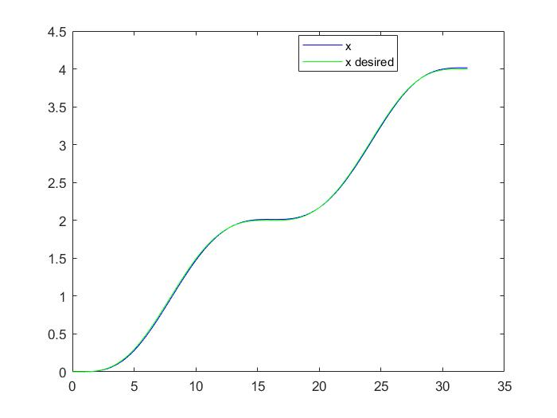
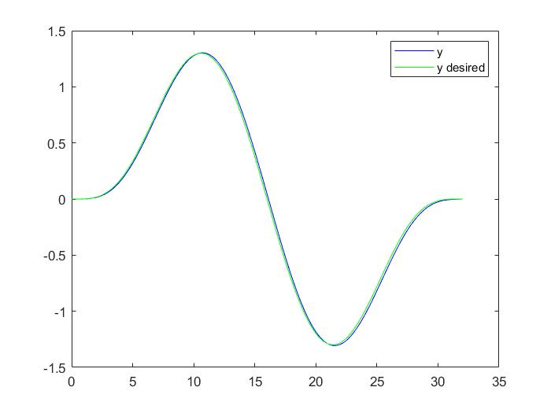
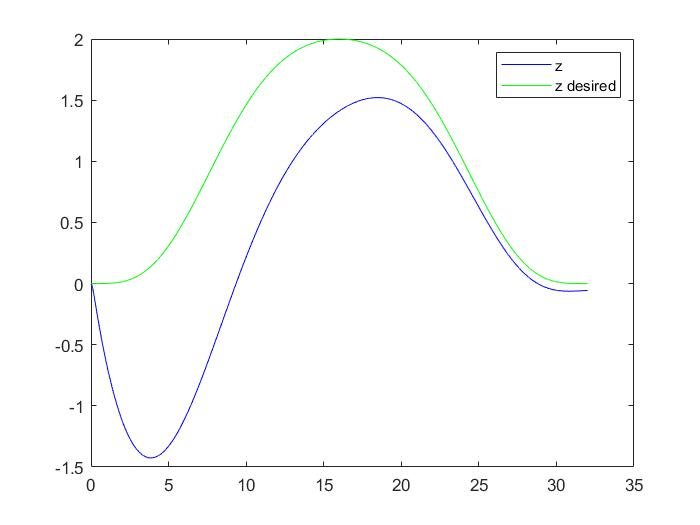
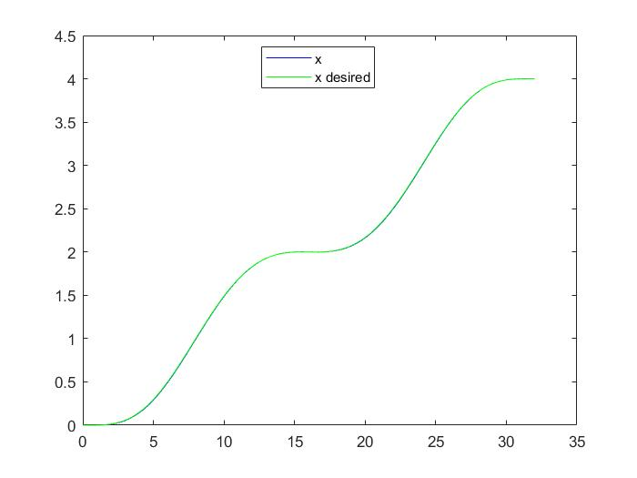
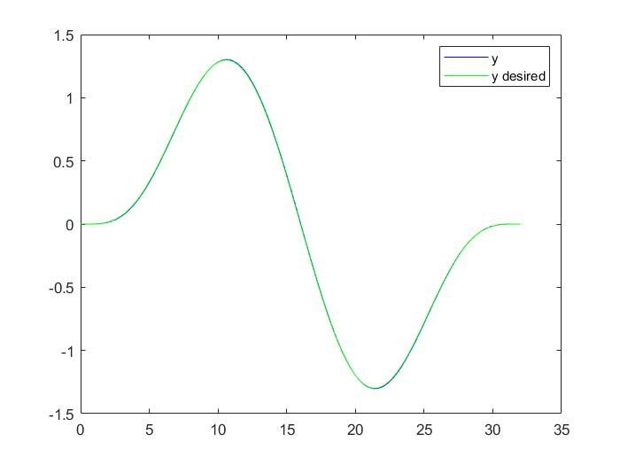
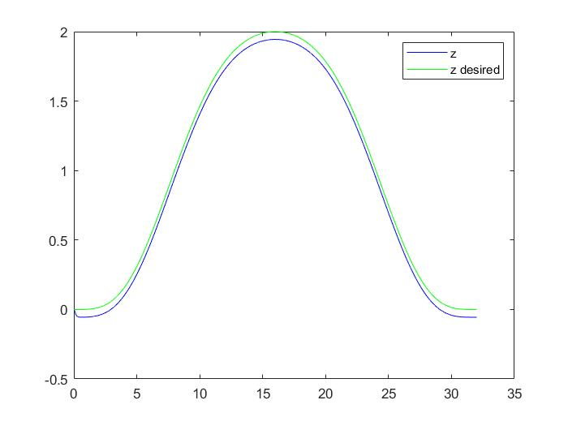
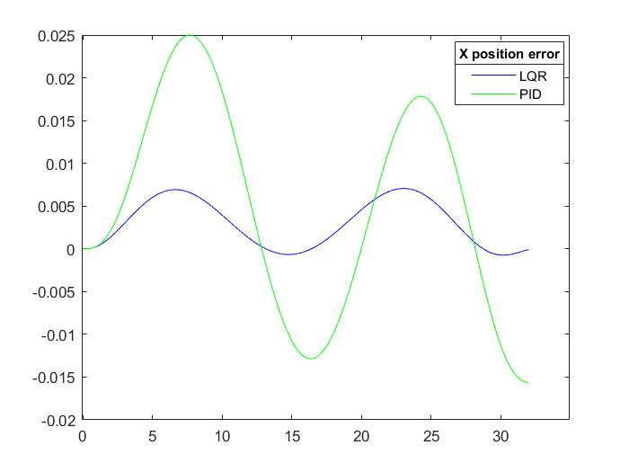
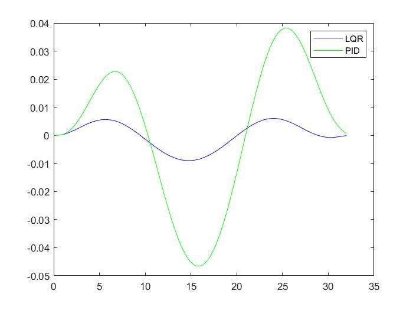
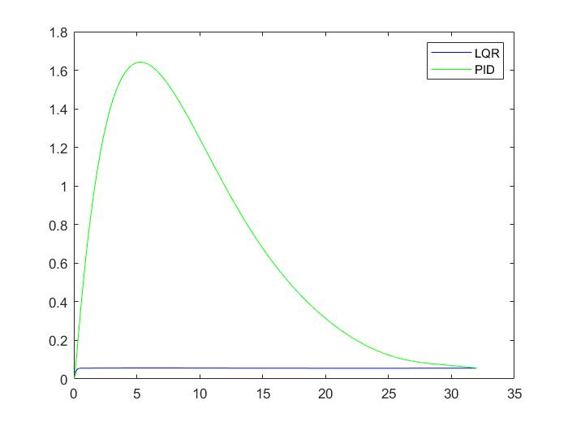

# Quadcopter_Control

## Introduction
  In this project,we will learn the dynamics of the Quadcopter and implement control algorithms on it.

## Altitude control of a 1D Quadcopter
### Hover at height 1 m

## 2D trajectory tracking using PID controller
Goal was to track the given two dimensional trajectories while minimising the position error.
### Line Trajectory

### Sine Trajectory

### Diamond Trajectory

## 3D trajectory tracking using PID controller
Goal was to track the given three dimensional trajectories while minimising the position error.
### Helix Trajectory

### Minimum Snap Trajectory through given waypoints

## Graphs
### Minimum Snap Trajectory following using PID
 | 
--------------------------------------------------------|-----------------------
  | 

### Minimum Snap Trajectory following using LQR
 | 
--------------------------------------------------------|-----------------------
  | 

### Comparison of Trajectory tracking error (LQR vs PID)
 | 
--------------------------------------------------------|-----------------------
  | 

## References
  * [Robotics: Aerial Robotics, by UPenn](https://www.coursera.org/learn/robotics-flight?=)
  * [Euler Quaternions PDF](https://www.ccs.neu.edu/home/rplatt/cs5335_fall2017/slides/euler_quaternions.pdf)
  * [Visualizing Quaternions](https://eater.net/quaternions/)
  * [State Space, by MATLAB Tech Talks](https://www.youtube.com/playlist?list=PLn8PRpmsu08podBgFw66-IavqU2SqPg_w)
  * [Dynamic modeling, Simulation and PID controller of Unmanned Aerial Vehicle UAV](https://drive.google.com/file/d/17vC72CxguJSLH8T1SG_DPBBhd8WRzE7P/view?usp=sharing)
  * [Modelling and Stabilizing Control laws design based on Backstepping for an UAV type Quadrotor](https://drive.google.com/file/d/1x7zfYDEAd4OGHKVt8xIQ0uwxMXA-TSl7/view?usp=sharing)
